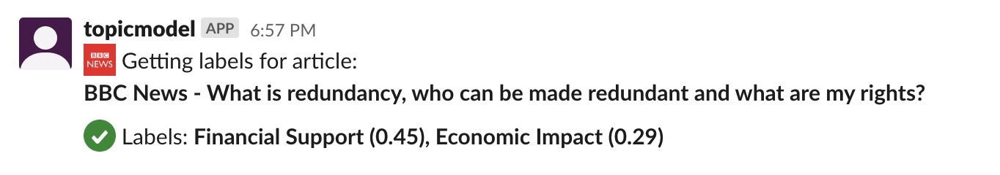

# Topic Model slack bot

Takes a bbc news article id, runs it through a trained topic model and writes out the automatically applied labels to slack.



- Adapted from stats realeases bot: https://github.com/bbc/vjdata.stats.releases, 
- Deployed onto the data solutions sandbox account
- Triggered with `/get-topics [article id]`


Main changes from stats releases:
- Removed all functionality and replace wth topic modeling code
- Changed env variables in makefile and templates, incliding api key to get article text
- Added to package script to delete package tests to reduced package size

Below this point the docs are from https://github.com/bbc/vjdata.stats.releases, things are a bit different in this repo but the general deployment is the same.

## 1. Setup

Requires Python 3, Docker and AWS CLI. The Makefile is the directory of commands needed to develop, deploy and run the scraper locally.

You need to: 

- Install [Docker for Mac](https://docs.docker.com/docker-for-mac/install/)

- Install [AWS CLI](https://docs.aws.amazon.com/cli/latest/userguide/cli-chap-install.html)

- Run `make clean_setup` this creates a virtual env and installs dependencies into it order to be able to run the scraper locally.

- Set env variables (required for running locally). These are the slack and dropbox api keys as well as the dropbox paper folder ids. Add these lines to your `~/.bash_profile`. See [this section](#how-you-can-get-the-required-auth-tokens) for more detail on getting these.
```
export STATS_RELEASES_SLACK_AUTH_TOKEN=<slack-token>
export STATS_RELEASES_SLACK_VER_TOKEN=<slack-verification-token>
export STATS_RELEASES_DROPBOX_TOKEN=<dropbox-token>
export STATS_RELEASES_DROPBOX_PAPER_FOLDER_ID_SLACK=e.1gg8YzoPEhbTkrhvQwJ2zznOCbjt6X9iB0985EX8CVF69swbzuSR
export STATS_RELEASES_DROPBOX_PAPER_FOLDER_ID_SCHEDULE=e.1gg8YzoPEhbTkrhvQwJ2zznOCbjt6WRdw5edAcJ6cswjsc1BWDZ2
```
- Run `source ~/.bash_profile`

## Run locally 

```
make local_invoke
```

Runs the `if __name__ == "__main__":` block in `lambda_function.py`. This reads an example event from the `events` folder and calls the lambda function with this example event. All outputs to slack and dropbox are the same as if it was running on aws.

## Deploy code

```
make package_deploy
```

Installs dependencies, zips them up with the lambda code, pushes zip file to s3 and updates the lambda with this zip file. Takes a minute or two to run.

## The 2 things you are likely to change 

### 1. The cron schedule 

Simply change the `SCHEDULE` variable to another [valid cron schedule](https://docs.aws.amazon.com/lambda/latest/dg/tutorial-scheduled-events-schedule-expressions.html) and run: 

```
make update_schedule
```

### 2. The scraping code if the websites change 

If you want to update the scrapers because the sites have changed the easiest way is to run the individual site scraping files, `ons.py`, `gss.py` and `scot.py`. At the bottom of each of these there is commented out code that runs the scraper for a custom date range. Just uncomment and run with e.g `python src/ons.py`. After you are happy the output of the scraper is correct comment out the code again, use `make local_inovoke` to run the whole app to ensure its posting correctly to slack. 


Finally deploy with `make package_deploy`.

## Logs

- The logs for API gateway and lambda can be found in cloudwatch -> log groups:
    - Lambda group will be `/aws/lambda/vjdata-stats-releases-lambda-function` where all print() statements are shown, this is where to come when debugging the deployed code.
    - API gateway log group `API-Gateway-Execution-Logs_6p8yqznzrj/LATEST`
- The releases that are ignored because their heading is included in `BBC/Visual Journalism/Data/2020/vjdata.stats.releases/ignore_releases/releases_to_ignore.csv` are written to `vjdata.stats.releases/ignored/` folder. Check these to ensure that scraped release are being deliberately ignored and not just missed by the scraper.

# Overview

## Overview of code 

- The `lambda_function.py` is the entry point, the `lambda_handler(event, context)` is run when the lambda is triggered.
- Code specific to scraping each website is contained in `gss.py` `ons.py` and `scot.py`, if the websites change their markup, these are the files to change accordingly.
- scrapers are called and data combined in `scraper.py`
- Code for posting to slack is in `post_to_slack.py`
- Code for reading and writing to dropbox is in `persistence.py`
- Error handling -  the `lamda_handler` wraps (almost) all of its code in a try except block, all functions called within will raise exceptions where necessary and are caught on in this block whereby there is an error output to slack and execution is haulted. This means there's only one place needed to have the error posting code. An exception to this is if scraping errors on a given site, this isn't reported but doesn't stop execution in order to give chance for other sites to be scraped successfully.

## Overview of infrastructure

The following aws resourses are used
- S3 bucket - to store the zip file holding all lambda code, when you run `make package_deploy` first all code is zipped up, then uploaded to S3 and then Lambda pulls in the zip file from the bucket.
- Lambda - where the code is executed on a schedule from cloudwatch event or by a request from api gateway
- API Gateway - a api that when called, triggers the lambda and proxies the request through to the lambdas event argument.

Cloud formation templates are in `/cloud-formation`:
- `code-bucket.yaml` - simply a single s3 bucket 
- `function` - the lambda and api gateway configuration
- `function-proxy` - the config with a lambda proxy integration for api gateway, had to not use this as you can't have async invocations with proxy integration. This is here just as a reference.

# How...

This section has more details on how parts of the app were made and work.

## How the infrastructure was created

Cosmos/Jenkins were completely avoided for the creation of the aws resources.
- The stacks:
    - The cloud formation templates `code-bucket.yaml` and `function.yaml` were created with with `make create_stacks` command. 
    - In order to create the stacks lots of permissions were granted and then immdiately removed after stacks created sucessfully. Namely:
    ```
    AmazonAPIGatewayInvokeFullAccess
    AmazonAPIGatewayPushToCloudWatchLogs
    AmazonAPIGatewayAdministrator
    AWSLambdaFullAccess
    IAMFullAccess
    AmazonS3FullAccess
    CloudWatchFullAccess
    AWSCloudFormationFullAccess
    ``` 

- Then a policy called `deploy-vjdata-stats-releases-lambda` was manually created in the console. This contains restricted permissions on only the specific resources to be able to deploy code to the lambda. The policy document for this is in `cloudformation/deploy_policy.json` file if it ever needs remaking.

- This policy then needs to be attached to the wormhole users. 

- The api endpoint was retrieved by running `make get_api_endpoint` and this was added to the slack app's [slash command](https://api.slack.com/apps/ASF6Z5W12/slash-commands?saved=1).

## How the slack slash command trigger was enabled 

- First get the POST endpoint url from the console. The stack is configured to output this url, there are three possible ways to get this url:
    - The easiest way to get this url is to run `make get_api_endpoint`, this runs the `describe-stacks` cli command and grabs the stack output. 
    - Alternatively go to the console: Cloud formation -> stats-releases-lambda-stack -> outputs tab, the ApiEndpoint url should be shown there. Looks something like `https://xxxxxxxxxx.execute-api.eu-west-1.amazonaws.com/LATEST/prod`. 

    - Alternatively you can dig into Api gateway itself to get this url


- Then go to the stats-releases app on https://api.slack.com/apps and go to slash commands on the left.
- Click edit on the `/get-stats` command
- Replace the Request url field with the invoke url from your api gateway. 
- Click save 
- The lambda can be triggered from slack with the command `/get-stats [from YYYY-MM-DD] [to YYYY-MM-DD]`, e,g `/get-stats 2020-03-10 2020-03-10`

Slack app                  | Slash command 
:-------------------------:|:-------------------------:
  |  

## How dates work
There are two date ranges that can be used by the app to gather stats releases between, these depend on how the lambda is triggered:
- Default schedule - if the lambda is triggered on schedule the date range is monday to saturday of the week after next.
- Slack trigger - if triggered by slack the specified dates give the date range. They must be in the future but not more than 6 months ahead. The dates are passed into the lambda in the `event` variable. Look at the example evene `events/event_slack_body.json` to see how the dates come in from a slack trigger.

Note the from date is inclusive and the to date is exclusive.

## How AWS access works

For every make command that interacts with aws the wormhole script is run (in `scripts/wormhole.py`). This script queries the wormhole API and gets back temporary aws credentials. These credentials are then written to your `.aws/credentials` file with a profile name of `[wormhole]`. These are used in the `--profile` parameter of every aws cli call. The credentials are for an assumed role that needs the `deploy-vjdata-stats-releases-lambda` policy attched. If you are getting access denied errors, chances are you don't have that policy attached to your role.


## How you can get the required auth tokens

If you haven't already been given them, you need to have these env variables:
```
export STATS_RELEASES_SLACK_AUTH_TOKEN=<slack-token>
export STATS_RELEASES_SLACK_VER_TOKEN=<slack-verification-token>
export STATS_RELEASES_DROPBOX_TOKEN=<dropbox-token>
export STATS_RELEASES_DROPBOX_PAPER_FOLDER_ID_SLACK=e.1gg8YzoPEhbTkrhvQwJ2zznOCbjt6X9iB0985EX8CVF69swbzuSR
export STATS_RELEASES_DROPBOX_PAPER_FOLDER_ID_SCHEDULE=e.1gg8YzoPEhbTkrhvQwJ2zznOCbjt6WRdw5edAcJ6cswjsc1BWDZ2
```

The slack tokens can be found in the stats-releases app in bbc workspace. First you must ask to be added as a collaborator of the app. Then go to https://api.slack.com/apps and find stats-releases, click install app on the left and you should be shown the Auth token starting with `xoxp-...`. The verification token can be found in the basic information tab.

For a dropbox token you should create your own dropbox app and generate a token from there. Follow the steps in stage 1 [here](https://www.ibm.com/support/knowledgecenter/SSYJ99_8.5.0/dev-portlet/Oauth2.0_dropbox_stored_acess_tokens.html).

The dropbox folder IDs are OK to have here in source code as they can't be used to access dropbox unless you have a dropbox token (deliberately NOT given here in source code).

## How slack slash commands are authenticated

We use the old way of authenticating slack requests, comparing the `token` value in the body of the request with the stats-releases verification token (stored in an env variable). The newer way was implemented but not used as makes testing a bit harder: 

- In `post_to_slack.py` the `validate_slack_request` function authenticates requests from slack, it hashes the timestamp and body with the signing secret and comapares to the `X-Slack-Signature` header. Followed instructions [here](https://api.slack.com/docs/verifying-requests-from-slack). Keep in mind this means the example slack event must be valid according to this auth routine. Tweaking the body to change dates will not work <- which is the reason we have not used this method.

## How the example events were made

In order to get an example event:
- Add the line `print(event)` to the first line of the `lambda_handler` function.
- Deploy the code, `make package_deploy`
- Go to cloudwatch logs to see the output. 

This is how the events in `/events` folder were generated. Is there an easier way?. 

If you use the slack event, the lambda will post to the `#stats-releases-test` slack channel.

## How the lambda is invoked asynchronously

As a slack slash cammand requires a response within 3 seconds and the lambda takes over 10 seconds to run, slack gives you a timeout error. To get around this we make api gateway trigger the lambda asynchronously and instantly return a 200 to slack. This is achieved by adding the `X-Amz-Invocation-Type` header to the api POST method integration request, with a static value of `'Event'`. [This](https://docs.aws.amazon.com/apigateway/latest/developerguide/set-up-lambda-integration-async.html) and [this](https://stackoverflow.com/questions/52452897/trying-to-add-x-amz-invocation-typeevent-to-existing-api-gateway-post-method) were used to work this out.


# Ref
- Slack slash command - https://medium.com/@farski/learn-aws-api-gateway-with-the-slack-police-2nd-edition-c5f3af9c1ec7
- Dropbox api with python - https://www.dropbox.com/developers/documentation/python#tutorial
- Setting up api gateway manually - https://paper.dropbox.com/doc/API-Gateway-Lambda--AshR02m1FJccf4omml3d1Z8VAg-FIu1pAg6NtEpw02V7WZaW
- Cloudformation for vj auto deploy lambda https://github.com/bbc/newsspec-24992-vj-autodeployer/blob/master/infrastructure/stacks/function.json - request templates
- Cloud formation for API gateway taken in part from:
    - https://docs.aws.amazon.com/AWSCloudFormation/latest/UserGuide/aws-resource-apigateway-method.html
    - https://github.com/bbc/newsspec-24992-vj-autodeployer/blob/master/infrastructure/stacks/function.json
    - As well adding to the template, `apigateway.amazonaws.com` was also needed to be added to `Principal: Service:` field in the `FunctionRole` resource.
- New auth method for slack requests - https://api.slack.com/docs/verifying-requests-from-slack
- Async invocation to avoid slack timeout error
    - https://docs.aws.amazon.com/apigateway/latest/developerguide/set-up-lambda-integration-async.html
    - https://stackoverflow.com/questions/52452897/trying-to-add-x-amz-invocation-typeevent-to-existing-api-gateway-post-method
    - https://medium.com/@piyush.jaware_25441/invoking-lambda-asynchronously-with-aws-api-gateway-bac75cb86062
